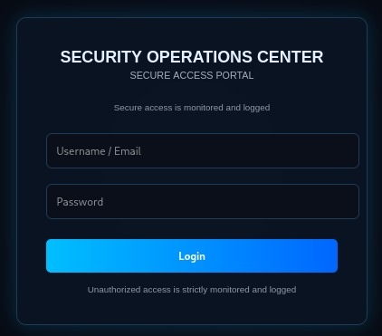
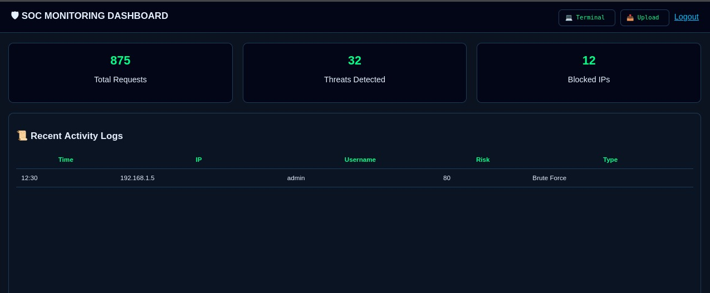
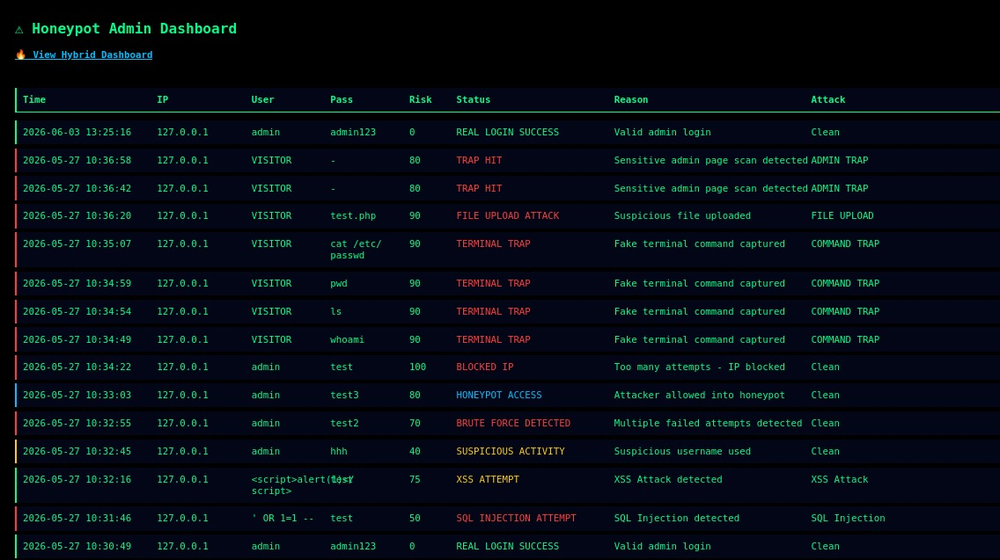
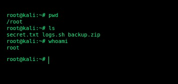
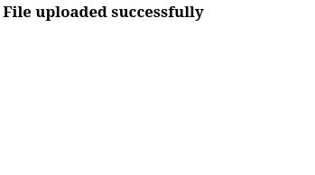
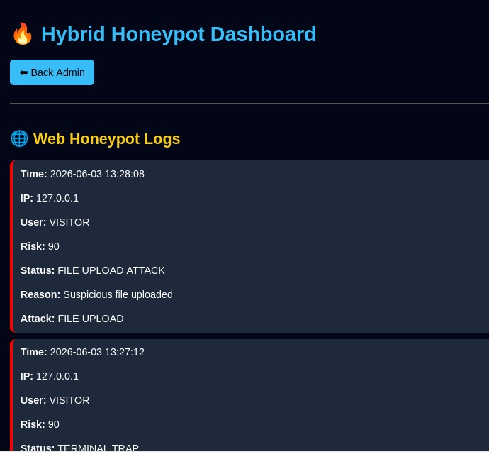
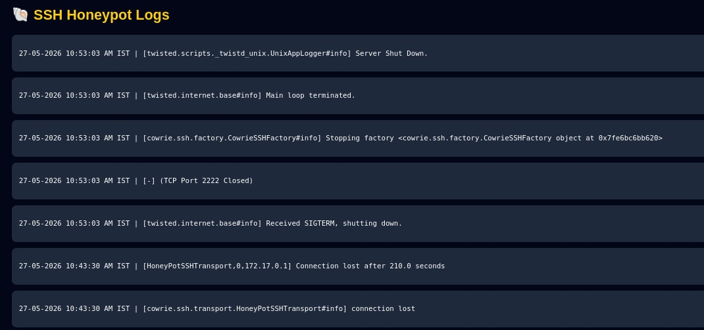
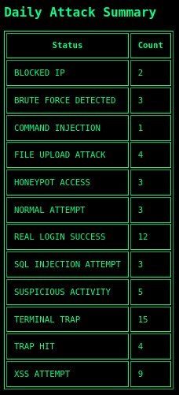

# 🔥 Hybrid Honeypot System with Attack Detection and Security Monitoring Dashboard

## 📌 Project Overview

This project is a **Hybrid Honeypot System** built using Flask, SQLite, and Cowrie SSH Honeypot. It simulates real-world attack scenarios and monitors malicious activities across web and SSH environments in a unified dashboard.

It detects multiple attack types and provides real-time security monitoring with risk scoring.

---

## 🚀 Features

### 🌐 Web Security Monitoring

* SQL Injection Detection
* XSS Attack Detection
* Command Injection Detection
* Local File Inclusion (LFI) Detection
* Brute Force Attack Detection
* IP Blocking System

### 🐚 SSH Attack Monitoring

* Integration with Cowrie SSH Honeypot
* Real-time SSH log analysis
* Suspicious command detection
* Risk scoring for SSH activities

### 📊 Security Dashboard

* Hybrid dashboard (Web + SSH logs)
* Attack classification system
* Risk-based alert system
* Daily summary reports

### 📁 Additional Features

* Fake admin panel traps
* Fake terminal for command capture
* File upload attack detection
* CSV export of logs
* Alert generation system

---

## 🛠️ Technologies Used

* Python 🐍
* Flask 🌐
* SQLite 🗄️
* HTML, CSS, JavaScript
* Cowrie SSH Honeypot
* Docker

---

## 📂 Project Structure

```
template/
    login.html
    admin.html
    dashboard.html
    terminal.html
    upload.html
    alerts.html
    ssh_logs.html
    hybrid_dashboard.html
    summary.html
```

---

## 🧠 Key Concepts Learned

* Web Application Security
* Attack Detection Techniques
* Honeypot Systems
* Log Analysis & Monitoring
* Risk Scoring Mechanism
* Blue Team Security Basics

---

## 📸 Screenshots

### Login page


### Dashboard


### Alerts


### Terminal


### Upload




### Hybrid Dashboard




### summary


---

## 📈 Future Improvements

* Real-time alert notifications
* Email/SMS alert system
* Machine learning-based threat detection
* Cloud deployment

---

## 👨‍💻 Author

Varun
Cyber Security Enthusiast
